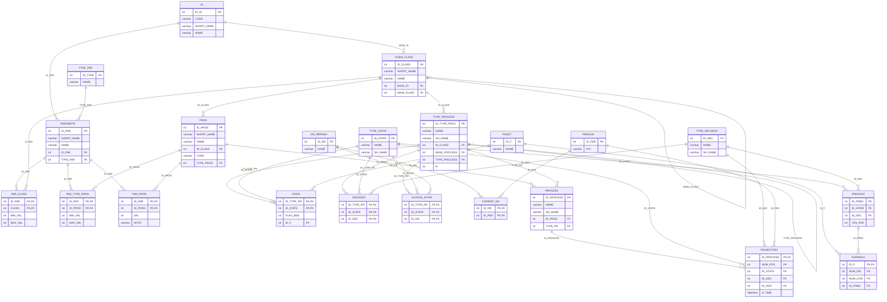

```mermaid
erDiagram
    %% ============================================================
    %% БЛОК 1. МОДЕЛЬ ДАННЫХ ОБ ИЗДЕЛИЯХ (рис. 10)
    %% ============================================================

    CHEM_CLASS {
        int ID_CLASS PK
        varchar SHORT_NAME
        varchar NAME
        int BASE_EI FK
        int MAIN_CLASS FK
    }

    EI {
        int ID_EI PK
        varchar CODE
        varchar SHORT_NAME
        varchar NAME
    }

    PROD {
        int ID_PROD PK
        varchar SHORT_NAME
        varchar NAME
        int ID_CLASS FK
        varchar CONF
        int TYPE_PROD FK
    }

    PAR_CLASS {
        int ID_PAR PK,FK
        int CLASS PK,FK
        int MIN_VAL
        int MAX_VAL
    }

    PAR_TYPE_PROD {
        int ID_PAR PK,FK
        int ID_PROD PK,FK
        int MIN_VAL
        int MAX_VAL
    }

    PAR_PROD {
        int ID_PAR PK,FK
        int ID_PROD PK,FK
        int VAL
        varchar NOTE
    }

    PARAMETR {
        int ID_PAR PK
        varchar SHORT_NAME
        varchar NAME
        int EI_PAR FK
        int TYPE_PAR FK
    }

    TYPE_PAR {
        int ID_TYPE PK
        varchar NAME
    }

    %% ============================================================
    %% БЛОК 2. СТРУКТУРА ПРОЦЕССОВ (рис. 11)
    %% ============================================================

    TYPE_PROCESS {
        int ID_TYPE_PROC PK
        varchar NAME
        varchar SH_NAME
        int ID_CLASS FK
        int BASE_PROCESS FK
        int TYPE_PROCESS FK
        int N
    }

    TYPE_STATE {
        int ID_STATE PK
        varchar NAME
        varchar SH_NAME
    }

    STATE {
        int ID_TYPE_PR PK,FK
        int ID_STATE PK,FK
        int FLAG_BEG
        int ID_F FK
    }

    TYPE_DECISION {
        int ID_DEC PK
        varchar NAME
        varchar SH_NAME
    }

    DECISION {
        int ID_TYPE_PR PK,FK
        int ID_STATE PK,FK
        int ID_DEC PK,FK
    }

    ACCESS_STATE {
        int ID_TYPE_PR PK,FK
        int ID_STATE PK,FK
        int ID_GR PK,FK
    }

    GR_PERSON {
        int ID_GR PK
        varchar NAME
    }

    CONSIST_GR {
        int ID_GR PK,FK
        int ID_PER PK,FK
    }

    PERSON {
        int ID_PER PK
        varchar FIO
    }

    %% ============================================================
    %% БЛОК 3. ТРАЕКТОРИЯ ДВИЖЕНИЯ (рис. 12)
    %% ============================================================

    PROCESS {
        int ID_PROCESS PK
        varchar NAME
        varchar SH_NAME
        int ID_PROD FK
        int TYPE_PR FK
    }

    TRAJECTORY {
        int ID_PROCESS PK,FK
        int NUM_POS PK
        int ID_STATE FK
        int ID_DEC FK
        int ID_PER FK
        datetime D_TIME
    }

    %% ============================================================
    %% БЛОК 4. ЛОГИКА ПЕРЕХОДОВ (рис. 13)
    %% ============================================================

    FUNCT {
        int ID_F PK
        varchar NAME
    }

    FORMULA {
        int ID_F PK,FK
        int NUM_DIS PK
        int NUM_CON PK
        int ID_PRED FK
    }

    PREDICAT {
        int ID_PRED PK
        int ID_STATE FK
        int ID_DEC FK
        int YES_PAR
    }

    %% ============================================================
    %% СВЯЗИ (по внешним ключам, как в исходных фрагментах)
    %% ============================================================

    %% --- Блок 1: изделия ---
    EI            ||--o{ CHEM_CLASS     : "BASE_EI"
    CHEM_CLASS    ||--o{ CHEM_CLASS     : "MAIN_CLASS"
    CHEM_CLASS    ||--o{ PROD           : "ID_CLASS"
    EI            ||--o{ PARAMETR       : "EI_PAR"
    TYPE_PAR      ||--o{ PARAMETR       : "TYPE_PAR"
    PARAMETR      ||--o{ PAR_CLASS      : "ID_PAR"
    CHEM_CLASS    ||--o{ PAR_CLASS      : "CLASS"
    PARAMETR      ||--o{ PAR_TYPE_PROD  : "ID_PAR"
    PROD          ||--o{ PAR_TYPE_PROD  : "ID_PROD"
    PARAMETR      ||--o{ PAR_PROD       : "ID_PAR"
    PROD          ||--o{ PAR_PROD       : "ID_PROD"

    %% --- Блок 2: структура процессов ---
    CHEM_CLASS    ||--o{ TYPE_PROCESS   : "ID_CLASS"
    TYPE_PROCESS  ||--o{ TYPE_PROCESS   : "BASE_PROCESS"
    TYPE_PROCESS  ||--o{ TYPE_PROCESS   : "TYPE_PROCESS"
    TYPE_PROCESS  ||--o{ STATE          : "ID_TYPE_PR"
    TYPE_STATE    ||--o{ STATE          : "ID_STATE"
    FUNCT         ||--o{ STATE          : "ID_F"
    TYPE_PROCESS  ||--o{ DECISION       : "ID_TYPE_PR"
    TYPE_STATE    ||--o{ DECISION       : "ID_STATE"
    TYPE_DECISION ||--o{ DECISION       : "ID_DEC"
    TYPE_PROCESS  ||--o{ ACCESS_STATE   : "ID_TYPE_PR"
    TYPE_STATE    ||--o{ ACCESS_STATE   : "ID_STATE"
    GR_PERSON     ||--o{ ACCESS_STATE   : "ID_GR"
    GR_PERSON     ||--o{ CONSIST_GR     : "ID_GR"
    PERSON        ||--o{ CONSIST_GR     : "ID_PER"

    %% --- Блок 3: траектория ---
    PROD          ||--o{ PROCESS        : "ID_PROD"
    TYPE_PROCESS  ||--o{ PROCESS        : "TYPE_PR"
    PROCESS       ||--o{ TRAJECTORY     : "ID_PROCESS"
    TYPE_STATE    ||--o{ TRAJECTORY     : "ID_STATE"
    TYPE_DECISION ||--o{ TRAJECTORY     : "ID_DEC"
    PERSON        ||--o{ TRAJECTORY     : "ID_PER"

    %% --- Блок 4: логика переходов ---
    FUNCT         ||--o{ FORMULA        : "ID_F"
    PREDICAT      ||--o{ FORMULA        : "ID_PRED"
    TYPE_STATE    ||--o{ PREDICAT       : "ID_STATE"
    TYPE_DECISION ||--o{ PREDICAT       : "ID_DEC"

```