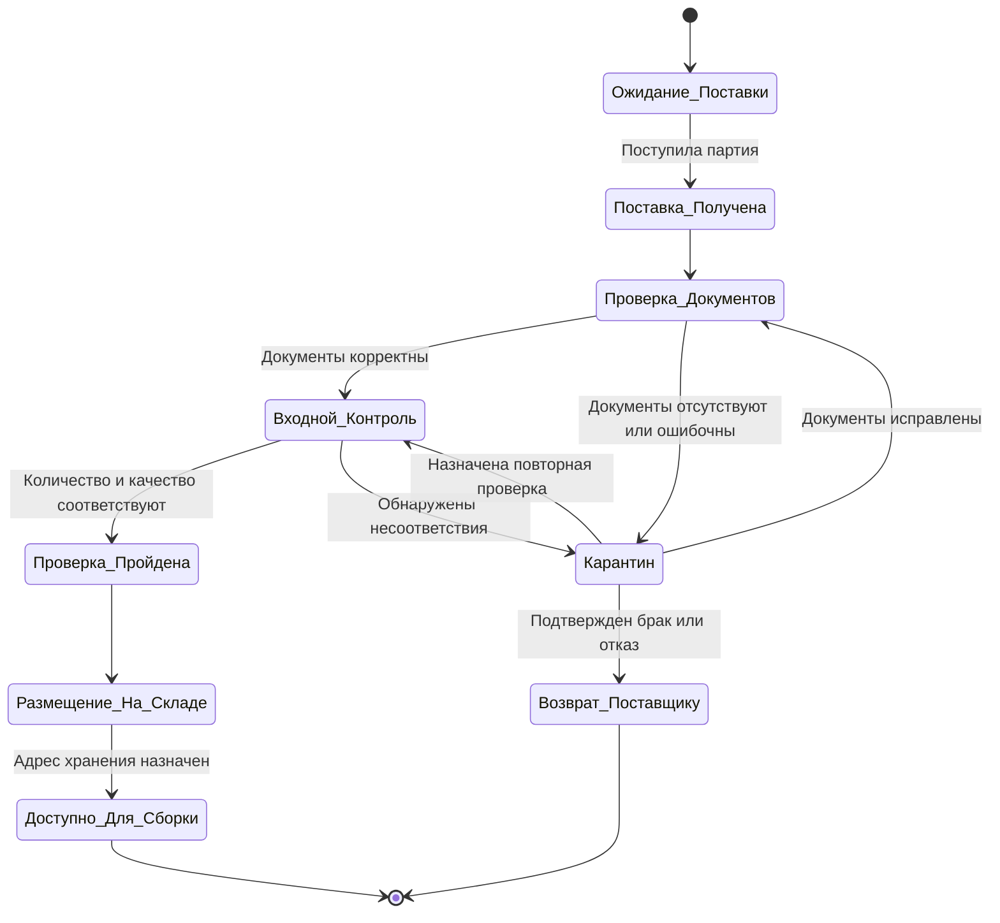

```mermaid

stateDiagram-v2
    direction TB

    [*] --> Ожидание_Поставки

    Ожидание_Поставки --> Поставка_Получена : Поступила партия
    Поставка_Получена --> Проверка_Документов

    Проверка_Документов --> Входной_Контроль : Документы корректны
    Проверка_Документов --> Карантин : Документы отсутствуют или ошибочны

    Входной_Контроль --> Проверка_Пройдена : Количество и качество соответствуют
    Входной_Контроль --> Карантин : Обнаружены несоответствия

    Карантин --> Проверка_Документов : Документы исправлены
    Карантин --> Входной_Контроль : Назначена повторная проверка
    Карантин --> Возврат_Поставщику : Подтвержден брак или отказ

    Проверка_Пройдена --> Размещение_На_Складе
    Размещение_На_Складе --> Доступно_Для_Сборки : Адрес хранения назначен

    Доступно_Для_Сборки --> [*]
    Возврат_Поставщику --> [*]
```

