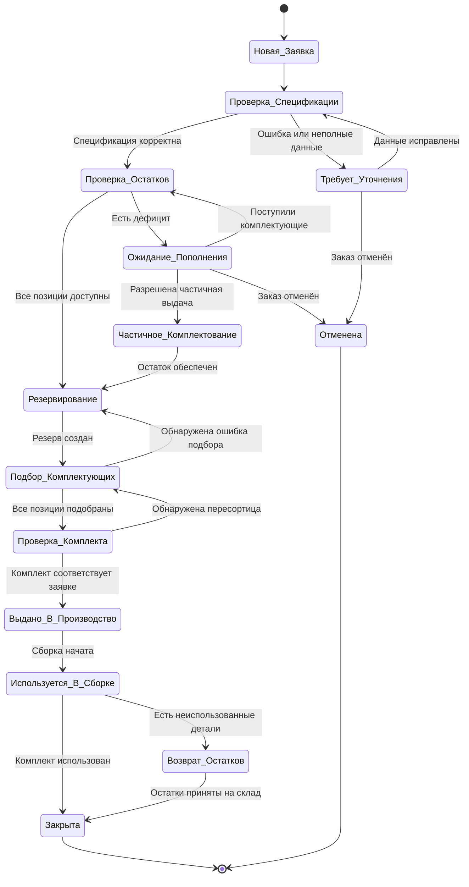

```mermaid

stateDiagram-v2
    direction TB

    [*] --> Новая_Заявка

    Новая_Заявка --> Проверка_Спецификации
    Проверка_Спецификации --> Проверка_Остатков : Спецификация корректна
    Проверка_Спецификации --> Требует_Уточнения : Ошибка или неполные данные

    Требует_Уточнения --> Проверка_Спецификации : Данные исправлены
    Требует_Уточнения --> Отменена : Заказ отменён

    Проверка_Остатков --> Резервирование : Все позиции доступны
    Проверка_Остатков --> Ожидание_Пополнения : Есть дефицит

    Ожидание_Пополнения --> Проверка_Остатков : Поступили комплектующие
    Ожидание_Пополнения --> Частичное_Комплектование : Разрешена частичная выдача
    Ожидание_Пополнения --> Отменена : Заказ отменён

    Частичное_Комплектование --> Резервирование : Остаток обеспечен

    Резервирование --> Подбор_Комплектующих : Резерв создан
    Подбор_Комплектующих --> Проверка_Комплекта : Все позиции подобраны
    Подбор_Комплектующих --> Резервирование : Обнаружена ошибка подбора

    Проверка_Комплекта --> Выдано_В_Производство : Комплект соответствует заявке
    Проверка_Комплекта --> Подбор_Комплектующих : Обнаружена пересортица

    Выдано_В_Производство --> Используется_В_Сборке : Сборка начата
    Используется_В_Сборке --> Закрыта : Комплект использован
    Используется_В_Сборке --> Возврат_Остатков : Есть неиспользованные детали

    Возврат_Остатков --> Закрыта : Остатки приняты на склад
    Отменена --> [*]
    Закрыта --> [*]

```